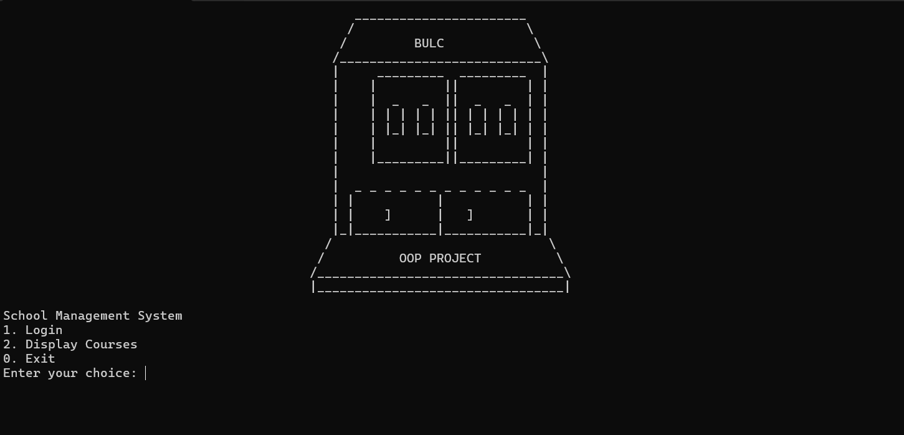
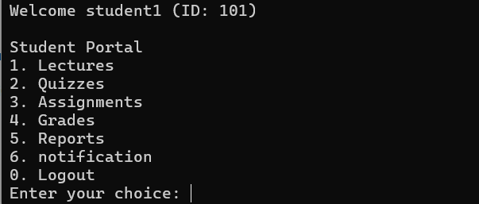
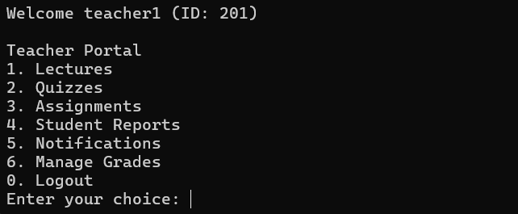
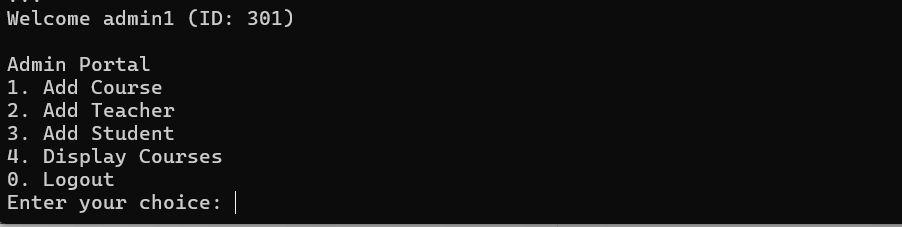

# Student Management System

Welcome to the **Student Management System** repository. This project is developed using C++ with Object-Oriented Programming (OOP) principles. The system facilitates the management of students, teachers, courses, and administrative tasks within an educational institution.

## Features

### User Roles
- **Admin**
  - Add new courses
  - Add new teachers
  - Add new students
  - Display available courses

- **Teacher**
  - Add lectures, quizzes, assignments, reports, and notifications
  - Manage student grades

- **Student**
  - View lectures, quizzes, assignments, reports, and notifications
  - View grades

### Authentication
- Secure login system for admins, teachers, and students.

### Course Management
- Admins can add and display courses.

### Notifications
- Teachers can send notifications to students.
- Students can view notifications.

### Grading System
- Teachers can add grades for quizzes.
- Students can view their grades.

### Reports
- Teachers can add reports for students.
- Students can view their reports.

## Screenshots

### Login Interface


### Student Portal


### Teacher Portal


### Admin Portal


## How to Use

1. **Clone the Repository**
   ```sh
   git clone https://github.com/iMamoonAkhter/student_management_system.git

Build and Run the Project
Ensure you have a C++ compiler installed.
Compile the code using your preferred C++ compiler.
Run the executable to start the application.

Contribution
Feel free to fork this project, create new branches, and submit pull requests. Any contributions are greatly appreciated.

License
This project is licensed under the MIT License. See the LICENSE file for details.
